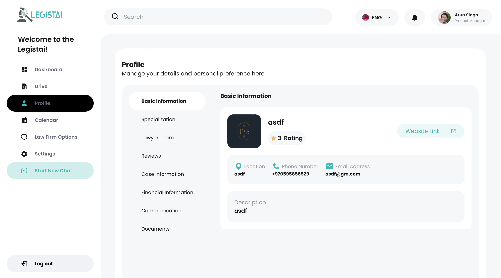

# Simple Dashboard (FLask & NextJS)

This project consists of a backend built with Flask and a frontend developed using Next.js. It allows users to register and view their profile information.



## Requirements

### Backend (Flask)

- Python 3.x
- Flask
- SQLAlchemy
- Flask-Cors
- ODBC Driver for SQL Server

### Frontend (Next.js)

- Node.js
- Next.js
- React

## Setup Instructions

### Backend Setup

1. **Clone the repository**:

   ```bash
   git clone https://github.com/hammamProg/NextJS-Flask-Dashboard.git
   cd NextJS-Flask-Dashboard/backend
   ```

2. **Create a virtual environment** (optional but recommended):

   ```bash
   python3 -m venv venv
   source venv/bin/activate  # On Windows use `venv\Scripts\activate`
   ```

3. **Install dependencies**:

   ```bash
   pip install -r requirements.txt
   ```

4. **Change your Database URI**

   ```bash
   # in file backend/app/__init__.py change the app.config['SQLALCHEMY_DATABASE_URI'] to your database URI
   ```

5. **Run the Flask app**:

   ```bash
   python3 run.py
   ```

   The backend should now be running at `http://localhost:8111`.

### Frontend Setup

1. **Open a new terminal** and navigate to the frontend directory:

   ```bash
   cd NextJS-Flask-Dashboard/frontend
   ```

2. **Install dependencies**:

   ```bash
   npm install
   ```

3. **Start the Next.js development server**:

   ```bash
   npm run dev
   ```

   The frontend should now be running at `http://localhost:3000`.
